EDAV PSet 1
================

### 1\. lakes

Choose one of the numeric variables in the `lakes` dataset.

#### a) Plot a histogram of the variable.

``` r
ggplot(lakes) + 
  geom_histogram(aes(x=MeanDepth),bins=20, colour = '#80593D', fill='#9FC29F') +
  ggtitle('Mean Depth of the Lakes') + 
  labs(x='MeanDepth', y='Count', caption='Source: alr4 lakes')+
  theme(plot.title = element_text(face = "bold"))
```

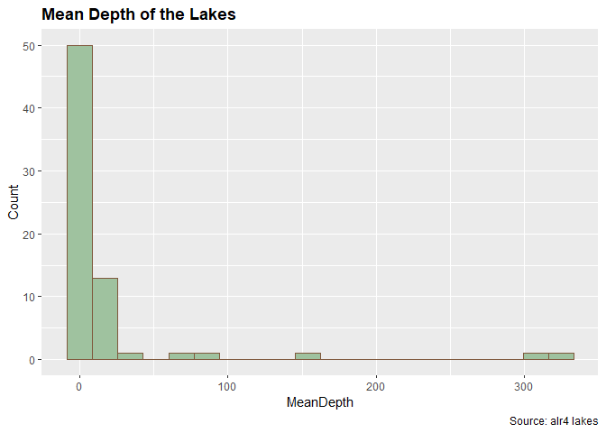<!-- -->

#### b) Create a new factor variable called `Species_size` from the `Species` column that divides the `Species` variable into three groups of equal range with levels `small`, `medium` and `large`. (Hint: use the `cut()` function.) Display the first 10 values of `Species_size`.

``` r
Species_size <- cut(lakes$Species, breaks=3, labels = c('small','medium','large'))
head(Species_size, 10)
```

    ##  [1] large  large  medium large  large  medium medium medium medium medium
    ## Levels: small medium large

#### c) Plot histograms,by `Species_size`, for the same variable.

``` r
ggplot(lakes) + 
  geom_histogram(aes(x=MeanDepth), binwidth = 5, colour = '#80593D', fill='#9FC29F') +
  ggtitle('Mean Depth of the Lakes Faceted by Species_size') + 
  labs(x='MeanDepth', y='Count', caption='Source: alr4 lakes')+
  facet_grid(Species_size) +
  theme(plot.title = element_text(face = "bold"))
```

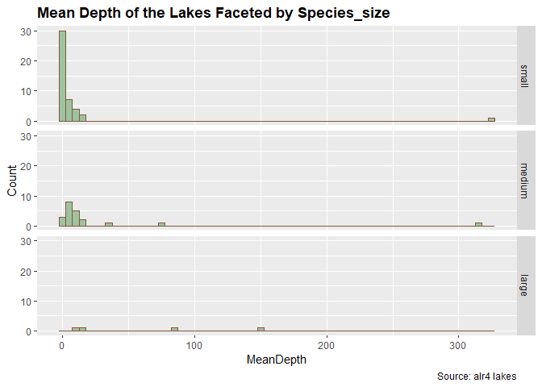<!-- -->

#### d) Plot multiple boxplots, grouped by `Species_size` for the same variable. The boxplots should be ordered by decreasing median from left to right.

``` r
ggplot(lakes) + 
  geom_boxplot(aes(x=reorder(Species_size,-MeanDepth,median),y=MeanDepth), colour = '#80593D', fill='#9FC29F', varwidth=TRUE) +
  ggtitle('Boxplots of Lakes Mean Depth By Species Size')+
  labs(x='Species Size', y='Mean Depth', caption='Source: alr4 lakes') +
  theme(plot.title = element_text(face = "bold"))
```

<!-- -->

#### e) Plot overlapping density curves of the same variable, one curve per factor level of `Species_size`, on a single set of axes. Each curve should be a different color.

``` r
ggplot(lakes) +
    geom_density(aes(x=MeanDepth, color=Species_size), bw=10) +
    ggtitle('Density Curves of Mean Depth By Species Size') + 
    theme(plot.title = element_text(face = "bold"))
```

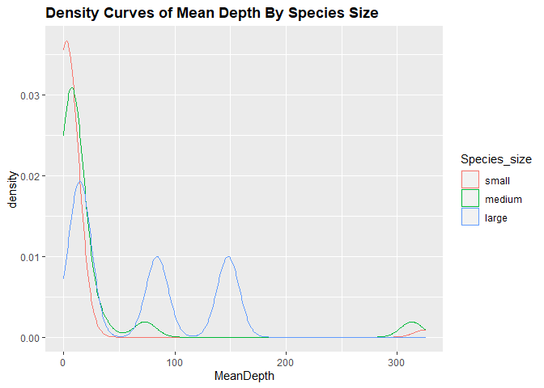<!-- -->

#### f) Summarize the results of c), d) and e): what unique information, *specific to this variable*, is provided by each of the three graphical forms? In other words, describe one by one what you learn from the histograms, boxplots, and density curves that the others don’t show as well or at all.

1.  Histogram displays an intuitive distribution of the mean depth of
    lakes by species size. We can clearly see that lakes with small
    species size almost exclusively have low mean depth (around 0) with
    very few exceptions. The larger the species size, the more likely it
    is that the lake has a high mean depth. Also,“small” group has the
    most lakes and “large” group has the least lakes.

2.  The boxplots focuses on the median, the quartiles, and the outliers.
    Median mean depth is higher for the group that has a larger species
    size. Th interquartile range of the mean depth is also higher for
    the larger group. We might infer from the plot that the mean depth
    of lakes with larger species size tend to spread out more and has
    higher variance. Besides, we can spot several outliers for the
    “small” and the “medium” group.

3.  The density curves provide us a glance of the potential continuous
    distribution of the mean depth of lakes given species size. It
    allows us to compare 3 densities directly in one graph. It give us a
    good sense of the trend of each distribution given different species
    sizes. The distributions are right skewed, and the larger the
    species size, the less skewed the distribution of the mean depth is.
    The larger the species size, the more variability we can expect in
    the mean depth of the lakes.

(Note: We do need to be conservative with our assertions since we only
have 4 data points in the “large” group.)

#### g) Briefly research the lake with the highest number of `Species`. What factors do you think contribute to this? Is this also the largest lake?

The lake with the highest number of `Species` is Michigan Lake. We found
two possible contributors for the number of `species`: “lake area (in
hectares)” and “distance to nearest lake (km)” by observing the original
data set. “Michigan” is not the largest lake. “Superior” is the largest
lake and its number of species ranked 3rd.

### 2\. Challeng

#### a) Draw two histograms of the `temp` variable in the `Challeng` dataset in the **alr4** package, with binwidths of 5 degrees and `boundary = 0`, one right open and one right closed. How do they compare?

``` r
ggplot(Challeng) + 
  geom_histogram(aes(x=temp), binwidth=5, boundary=0, closed='left', colour = '#80593D', fill='#9FC29F') +
  ylim(0,10) + 
  ggtitle('Histogram of temp Variable with Right Open') + 
  labs(caption='Source: alr4 Challeng') + 
  theme(plot.title = element_text(face = "bold"))
```

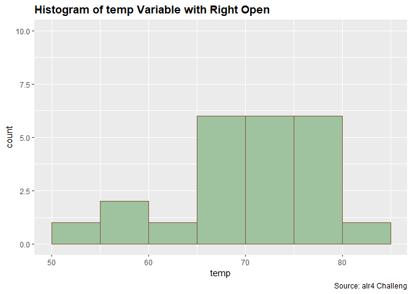<!-- -->

``` r
ggplot(Challeng) + 
  geom_histogram(aes(x=temp), binwidth=5, boundary=0, closed='right', colour = '#80593D', fill='#9FC29F') + 
  ylim(0,10) + 
  ggtitle('Histogram of temp Variable with Right Closed') + 
  labs(caption='Source: alr4 Challeng') +
  theme(plot.title = element_text(face = "bold"))
```

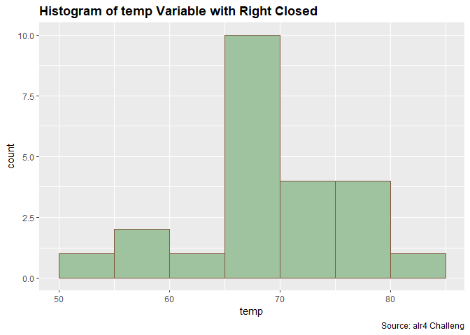<!-- -->

These two plots seem to come from different distributions just because
of the closeness of different boundaries. When the left side is closed,
the plot looks less normal and more left skewed; when the right side is
closed, the distribution looks more normal and less left skewed.

#### b) Redraw the histogram using the parameters that you consider most appropriate for the data. Explain why you chose the parameters that you chose.

We choose `binwidth` equal to 4 for the following 2 reasons:

1.  The two distributions look similar no matter which side of the
    boundaries is closed (i.e, the distribution with the right side
    closed is similar to the distribution with the left side closed).
2.  Set `binwidth=4` reflects the trend of the distribution of the data
    better compared with the histograms with a lower `binwidth`.

Here is the code and the plot.

``` r
ggplot(Challeng) + 
  geom_histogram(aes(x=temp), binwidth=4, boundary=0, closed='left', colour = '#80593D', fill='#9FC29F') + 
  ylim(0,10) + 
  ggtitle('Histogram of temp Variable Right Open (binwidth=4)') + 
  labs(caption='Source: alr4 Challeng') +
  theme(plot.title = element_text(face = "bold"))
```

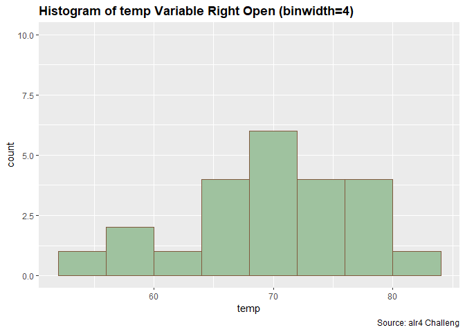<!-- -->

``` r
ggplot(Challeng) + 
  geom_histogram(aes(x=temp), binwidth=4, boundary=0, closed='right', colour = '#80593D', fill='#9FC29F') + 
  ylim(0,10) + 
  ggtitle('Histogram of temp Variable Right Closed (binwidth=4)') + 
  labs(caption='Source: alr4 Challeng') +
  theme(plot.title = element_text(face = "bold"))
```

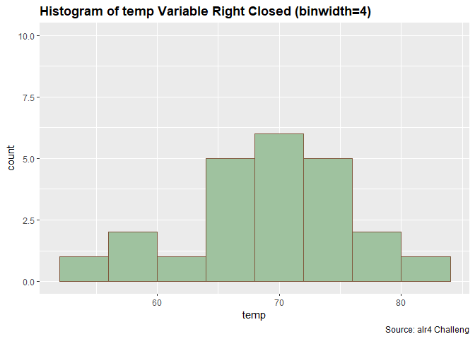<!-- -->

### 3\. drugcost

#### a) Use **tidyr** functions to convert the numeric columns in the `drugcost` dataset in the **alr4** package to two columns: `variable` and `value`. The first few rows should be:

``` 
    variable      value
1       COST       1.34
2       COST       1.34
3       COST       1.38
4       COST       1.22
```

Use this form to plot histograms of all of the variables in one plot by
faceting on `variable`. What patterns do you observe?

``` r
pivot_data <- gather(drugcost)
pivot_data$key <- as.factor(pivot_data$key)

ggplot(pivot_data) +
  geom_histogram(aes(value), colour = '#80593D', fill = '#9FC29F') +
  facet_wrap(pivot_data$key, scales = 'free') +
  labs(caption='Source: alr4 drugcost') + 
  ggtitle('Histograms of All Variables') + 
  theme(plot.title = element_text(face = "bold"))
```

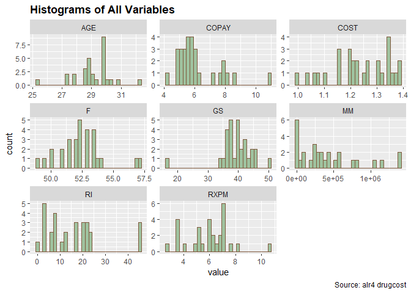<!-- -->

Most of these variables seem normally distributed, including `AGE`,
`COPAY`, `COST`, `F`, `GS` and `RXPM`, excluding `RI`. `MM` looks like
an exponential distribution.

#### **For the remaining parts we will consider different methods to test for normality.**

#### b) Choose one of the variables with a unimodal shape histogram and draw a true normal curve on top on the histogram. How do the two compare?

``` r
ggplot(drugcost) +
  geom_histogram(aes(x=F, y=..density..),bins=30, colour = '#80593D', fill='#9FC29F') +
  stat_function(fun = dnorm, args = list(mean = mean(drugcost$F), sd = sd(drugcost$F))) +
  labs(caption='Source: alr4 drugcost') + 
  ggtitle('Histogram of Variable F') + 
  theme(plot.title = element_text(face = "bold"))
```

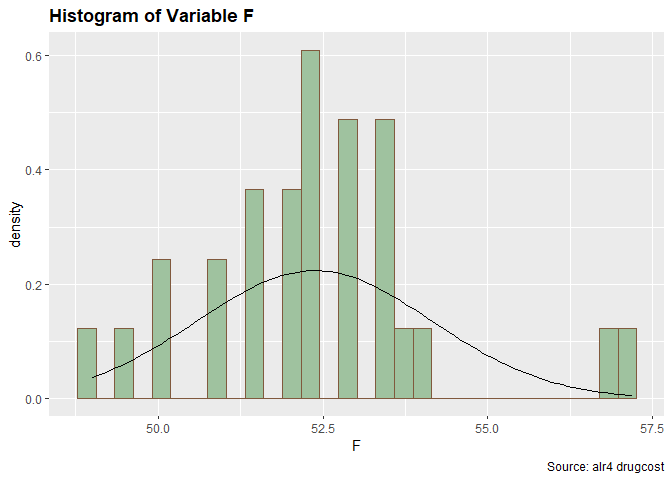<!-- -->

It’s hard to tell whether `F` seems to come from a normal distribution.
The shape of the density of variable `F` seems to resemble a bell curve.
But at most values the density of `F` is much higher than that of a
normal distribution with the same mean and std.

#### c) Perform the Shapiro-Wilk test for normality of the variable using the `shapiro.test()` function. What do you conclude?

``` r
shapiro.test(drugcost$F)
```

    ## 
    ##  Shapiro-Wilk normality test
    ## 
    ## data:  drugcost$F
    ## W = 0.92826, p-value = 0.04959

With a p-value of 0.0496, we reject the hypothesis that variable `F`
comes from a normal distribution at an alpha level of 0.05. \#\#\#\# d)
Draw a quantile-quantile (QQ) plot of the variable. Does it appear to be
normally distributed?

``` r
F_data <- drugcost$COST
qqnorm(F_data,pch = 1)
qqline(F_data,col = "steelblue", lwd = 2)
```

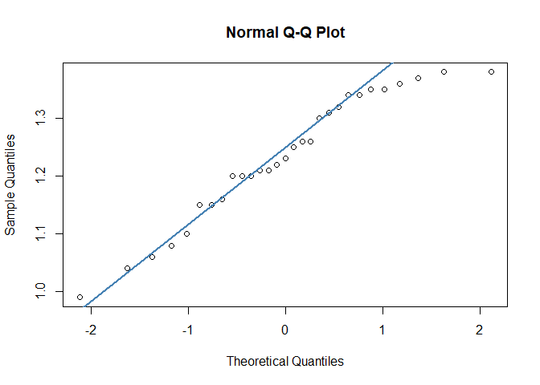<!-- -->

Since most of these data points stick around the QQ-line, it appears
that the variable `F` is normally distributed.

#### e) Use the **nullabor** package to create a lineup of histograms in which one panel is the real data and the others are fake data generated from a null hypothesis of normality. Can you pick out the real data? If so, how does the shape of its histogram differ from the others?

``` r
samples <- lineup(null_dist("F", dist='normal'), drugcost)
ggplot(samples) + 
  geom_histogram(aes(x=F,y=..density..), colour = '#80593D', fill='#9FC29F') +
  facet_wrap(~ .sample)+
  labs(caption='Source: alr4 drugcost') + 
  ggtitle('Find the Real Data') + 
  theme(plot.title = element_text(face = "bold"))
```

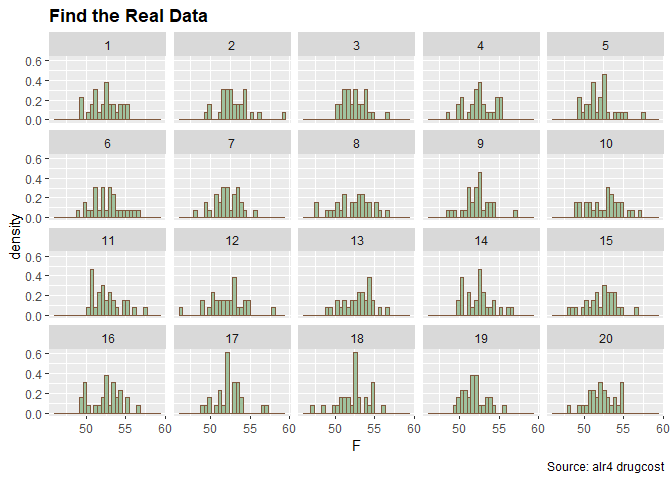<!-- -->

No, we can’t tell the real data from the fake ones.

#### f) Show the lineup to someone else, not in our class (anyone, no background knowledge required). Ask them which plot looks the most different from the others. Did they choose the real data?

No, they did not choose the real data.

#### g) Briefly summarize your investigations. Did all of the methods produce the same result?

We concluded from the Shapiro-Wilk test that `F` does not come from a
normal distribution. But in terms of the method of lineup of histograms,
we can’t tell a big difference among these histograms. For the QQ-plot,
we also came to believe that the data looks fairly normal. But given
that the Shapiro-Wilk test output a p-value very close to 0.05, it is
reasonable to expect that the visualization methods would not provide us
with definitive answers.
