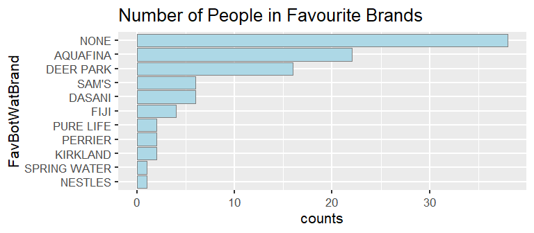

EDAV PSet 2
================

### 1\. Water Taste Test

Data: `WaterTaste` dataset in the **Lock5withR** package (available on
CRAN)

1)  Recode the `Class` and `Sex` columns using the human readable values
    listed in the help file. Display the first six rows of these two
    columns.

<!-- end list -->

``` r
# recode the factors
levels(WaterTaste$Class) <- fct_recode(levels(WaterTaste$Class), 'First year'='F','Sophomore' = 'SO','Junior'='J','Senior'='SR','Other'='O')
levels(WaterTaste$Gender) <- fct_recode(levels(WaterTaste$Gender), Female = "F", Male = "M")

# reorder the Class factor 
WaterTaste$Class <- fct_relevel(WaterTaste$Class, "First year", "Sophomore", "Junior", "Senior","Other")

# display the first 6 rows 
head(WaterTaste %>% select(Gender, Class), 6)
```

    ##   Gender      Class
    ## 1 Female First year
    ## 2 Female First year
    ## 3 Female First year
    ## 4 Female First year
    ## 5   Male     Junior
    ## 6   Male     Junior

2)  Create a horizontal bar chart of `FavBotWatBrand` counts.

<!-- end list -->

``` r
WaterTaste %>%
  group_by(FavBotWatBrand) %>% 
  tally() %>%
  ggplot(aes(fct_reorder(FavBotWatBrand, n), n)) + 
  geom_col(color ="grey50", fill ="lightblue") +
  coord_flip() + 
  xlab("FavBotWatBrand")+
  ylab("counts")+
  ggtitle("Number of People in Favourite Brands")+
  theme_grey(16)
```



3)  Create a vertical bar chart of `Class` counts.

<!-- end list -->

``` r
ggplot(WaterTaste, aes(Class))+
  geom_bar(color ="grey50", fill ="lightblue") +
  xlab("Class")+
  ylab("counts")+
  ggtitle("Number of People in Classes")+
  theme_grey(16)
```


4)  Create a vertical grouped bar chart of `Class` and `UsuallyDrink` in
    which each level of `Class` forms one group containing three bars
    representing the three levels of `UsuallyDrink`.

<!-- end list -->

``` r
WaterTaste %>% 
  group_by(Class, UsuallyDrink) %>% 
  summarize(count=n()) %>%
  ggplot(aes(fill=UsuallyDrink,y=count, x=Class)) +
  geom_bar(position="dodge",stat="identity") + 
  xlab("Class")+
  ylab("UsuallyDrink")+
  ggtitle("Number of UsuallyDrink in Classes") +
  theme_grey(16)
```


5)  Create a horizontal stacked bar chart of proportions showing the
    type of water respondents usually drink by Class. The order of the
    levels of both categorical variables should match what is shown in
    the assignment. (Note that the order of the fill colors of the bars
    match the order of the fill colors in the legend.)

<!-- end list -->

``` r
WaterTaste %>% 
  group_by(Class, UsuallyDrink) %>% 
  summarize(count=n()) %>% 
  mutate(prop = count/sum(count)) %>%
  ggplot(aes(fill=UsuallyDrink, x=fct_rev(Class), y=prop)) + 
  geom_bar(position='fill', stat='identity') +
  coord_flip() +
  theme(legend.position = "bottom")+
  xlab("Class")+
  ylab("UsuallyDrink Proportion")+
  ggtitle("proportions of UsuallyDrink in Classes")
```


6)  Create a horizontal stacked bar chart showing the proportional
    breakdown of `Class` for each level of `UsuallyDrink`, faceted on
    `Gender`. Use a descriptive title. (See assignment for example.)

<!-- end list -->

``` r
summary <- WaterTaste %>% 
  group_by(Class, Gender, UsuallyDrink) %>% 
  summarize(count=n()) %>% 
  mutate(prop = count/sum(count)) 

ggplot(data = summary, aes(fill=UsuallyDrink, x=fct_rev(Class), y=prop)) + 
  geom_bar(position='fill', stat='identity') +
  facet_grid(summary$Gender) + 
  theme(strip.text.y = element_text(size=12, face="bold")) + 
  coord_flip() + 
  theme(legend.position = "bottom")+
  xlab("Class")+
  ylab("Proportion") +
  ggtitle("proportions of UsuallyDrink in Classes")
```


### 2\. Metacritic

To get the data for this problem, we’ll scrape data from
`www.metacritic.com`. Important: you should only execute parts (a) and
(b) *once*. Therefore, it should be clear to us that the code isn’t
being run each time you knit the document. You may either set
`eval=FALSE` in these chunks or comment out the appropriate lines.

1)  Use the `paths_allowed()` function from **robotstxt** to make sure
    it’s ok to scrape
    <https://www.metacritic.com/publication/digital-trends>. What is the
    result?

<!-- end list -->

``` r
paths_allowed('https://www.metacritic.com/publication/digital-trends')
```

The output evaluates to `TRUE`.

2)  Use the **rvest** package to read the URL in part (a), and then find
    the title, metascore and critic score for each game listed. Create a
    data frame with these three columns and save it. (You may remove any
    rows with missing data.)

<!-- end list -->

``` r
scrap <- function(web, pagenum, node) {
  data <- lapply(paste0(web, pagenum),
    function(url){
      url %>% read_html() %>% 
        html_nodes(node) %>% 
        html_text()   
  })
  return(unlist(data))
}

# scrap the page 
web <- 'https://www.metacritic.com/publication/digital-trends?page='
name <- scrap(web, 0, '.review_product a')
metascore <- scrap(web, 0, '.brief_metascore .game')
criticscore <- scrap(web, 0, '.brief_critscore .indiv')

# convert lists to a dataframe
movie_data <- data.frame("Title" = name, "CriticScore" = as.numeric(criticscore), "MetaScore" = as.numeric(metascore))

# drop the missing values
movie_data <- drop_na(movie_data)
save(movie_data,file="movie_data.Rda")
```

3)  Read your saved data back in and display the first six rows.

<!-- end list -->

``` r
load("movie_data.Rda")
head(movie_data,6)
```

    ##                           Title CriticScore MetaScore
    ## 1      Super Mario 3D All-Stars          80        82
    ## 2                  Iron Harvest          60        75
    ## 3                   Wasteland 3          80        86
    ## 4  Fall Guys: Ultimate Knockout          90        80
    ## 5    The Sims 4: Nifty Knitting          80        63
    ## 6 Paper Mario: The Origami King          70        79

4)  Create a Cleveland dot plot of metascores.

<!-- end list -->

``` r
# create a theme for dot plots, which can be reused
theme_dotplot <- theme_bw(14) +
    theme(axis.text.y = element_text(size = rel(.75)),
        axis.ticks.y = element_blank(),
        axis.title.x = element_text(size = rel(.75)),
        panel.grid.major.x = element_blank(),
        panel.grid.major.y = element_line(size = 0.5),
        panel.grid.minor.x = element_blank())

# create the plot
ggplot(movie_data, aes(x=MetaScore, y=reorder(Title, MetaScore))) + 
  geom_point(color = "blue") + 
  scale_x_continuous(limits = c(50, 100),
        breaks = seq(50, 100, 10)) + 
  theme_dotplot +
    xlab("MetaScore of Movies") +
    ylab("Name of Movies") 
```


5)  Create a Cleveland dot plot of metascore *and* critic score on the
    same graph, one color for each. Sort by metascore.

<!-- end list -->

``` r
tidyMovie <- movie_data %>% gather(key='score_type', value='score', -Title)
tidyMovie$Title <- factor(tidyMovie$Title)

ggplot(tidyMovie,aes(score,fct_reorder2(Title, score_type=="MetaScore", score, .desc = FALSE))) + 
  geom_point(aes(color=score_type)) + 
  ggtitle("Scores of Movies") + 
  ylab("") + 
  theme_dotplot 
```


### 3\. Nutrition

For parts (a) - (d) draw four plots of `calories` vs. `carbohydrates` as
indicated. For all, adjust parameters to the levels that provide the
best views of the data.

1)  Points with alpha blending

<!-- end list -->

``` r
nutrition_plot <- ggplot(data=nutrition, aes(carbohydrates, calories))

nutrition_plot + 
  geom_point(alpha=0.3) +
  ggtitle("Relationship between calories and carbohydrates (alpha = 0.3)")
```


2)  Points with alpha blending + density estimate contour lines

<!-- end list -->

``` r
nutrition_plot +       
  geom_point(alpha = 0.3, color = "blue")+
  geom_density2d(linetype = "twodash", color = "red", size = 0.75) +
  ggtitle("Relationship between Calories and Carbohydrates with Density Curves")
```


3)  Hexagonal heatmap of bin counts

<!-- end list -->

``` r
nutrition_plot + 
  geom_hex(bins=16) +
  ggtitle("Hexagonal Heatmap of Calories and Carbohydrates")
```


4)  Square heatmap of bin counts

<!-- end list -->

``` r
nutrition_plot + 
  geom_bin2d(bins=16) +
  ggtitle("Square Heatmap of Calories and Carbohydrates")
```


5)  Describe noteworthy features of the relationship between the
    variables based on your plots from parts (a)-(d), using the “Movie
    ratings” example on page 82 (last page of Section 5.3) as a guide.
    Which one do you think is most informative and why?

*Let `Cal` denote `calories` and let `Car` denote `carbohydrates`.* The
plot graph (a) shows us the relationship between Cal and Car of
different food. Here are some insights:

1.  The majority of dots are within the range when Cal is less than 430
    and Car is less than 40.

2.  The majority of dots lie around the line of `Car = 0.267*Cal` and
    `Car = 0`. The other dots are loosely dispersed within the range of
    these two lines.

3.  There is almost a positive linear relationship between Car and
    minimum Cal. It is almost as if Car provide a lower bound for Cal
    with very few exceptions. Similarly, there also seems to be a
    negative linear relationship between Car and the maximum Cal such
    that Car provide an upper bound for Cal.

4.  Only a small proportion of food have high Cal (exceeds 500), but
    their Car seem to be low.

5.  There is a heavy cluster of foods around 75 Car and 350 Cal.

6.  There are quite a number of food with 0 or very low Car, but their
    Cal vary a lot. The foods with the highest Cal have 0 Car.

The plot graph in (b) provides us with a more accurate understanding of
where the dots are densely distributed. In graph (a), we can simply
judge the distribution with our intuition, while with the density
estimate contour in graph (b), we can verify our ideas.

The heatmaps from (c) and (d) of bin counts show us the general
distribution of the relationship between Cal and Car as well as counting
the exact quantity of how many dots are lying in one specific area of
the graph. With these two graphs, we can have a better grasp of the
generalized distribution.

6)  Recreate your scatterplot from part (a) with `gray80` for the color,
    adding an additional `geom_point()` layer only containing points for
    foods in the top three food categories (`group` column) by count.
    What do you learn?

<!-- end list -->

``` r
# find the top 3 food
top3 <- nutrition %>% group_by(group) %>% tally() %>% arrange(desc(n)) %>% top_n(3)
top3_nutrition <- nutrition %>% filter(group %in% top3$group)

ggplot()+
  geom_point(data=nutrition, aes(carbohydrates, calories), color='grey80') +
  geom_point(data=top3_nutrition, aes(carbohydrates, calories,color=factor(group)), alpha=0.5)+ 
  theme(legend.title = element_blank()) + 
  ggtitle("Top 3 Food Among All Food")
```


The top 3 kinds of food display very different distributions. In
general, Baked Products have high calories and high carbohydrates, Beef
Products have almost 0 carbohydrates while their calories vary a lot,
and Vegetable Products have low carbohydrates and calories.

### 4\. Australian Institute of Sport data

Data: `ais` dataset in **alr4** package (available on CRAN)

1)  Draw a scatterplot matrix of the continuous variables in the `ais`
    dataset. Which pairs of variables (if any) are strongly positively
    associated and which are strongly negatively associated?

Since there are too many continuous variables in `ais` dataset, trying
to combine them in one graph will be too crowded. Therefore, we seperate
the variables into three groups, namely the `figure` group, the `blood`
group and `SSP` group. Among them, `figure` contains the variable of
`Ht`, `Wt`, `LBM` `Bfat` and `BMI`, which are often used to measure a
person’s figure. `blood` group contains the variable of `RCC`, `WCC`,
`Hc`, `Hg`, `Ferr`, which are often used to measure blood status. `SSF`
group contains the variable of `SSF` only. This variable denotes the sum
of skin folds. It does not have a clear relationship with `figure` or
`blood`, so we set it up as the third group.

``` r
# figure related indexes
pairs(~ Ht + Wt + LBM + Bfat + BMI, data = ais,
      lower.panel = panel.smooth)
```


The matrix above shows that `Ht`, `Wt` and `LBM` are strongly positively
associated with each other since when the value of one variable
increases, the value of another variable increases proportionally.
`BMI`, `Wt` and `LBM` are also strongly positively associated with each
other for the same reason. There aren’t any variables that are strongly
negatively associated with each other.

``` r
# blood related indexes
pairs(~ RCC + WCC + Hc + Hg + Ferr, data = ais,
      lower.panel = panel.smooth)
```


The matrix above shows that `RCC`, `Hc` and `Hg` are strongly positively
associated with each other since when the value of one variable
increases, the value of another variable increases proportionally. There
aren’t any variables that are strongly negatively associated with each
other.

``` r
# indexes relation between three groups (figure, blood and wrinkle)
pairs(~ RCC + WCC + Ferr + BMI + Ht + Bfat + SSF, data = ais,
      lower.panel = panel.smooth)
```


Then, we select variables with small correlations from the the
categories of `figure` and `blood`, namely `RCC`, `wcc`, `Ferr`, `BMI`,
`Ht` and `SSF`, and measure their correlations between each other and
their correlations with variable `SSF`. It can be discovered that `SSF`
has a strong positive correlation with `Bfat`. For other variables, they
are strongly positively or negatively associated with each other.

2)  Color the points by `Gender`. Do new patterns emerge? Describe a few
    of the most prominent.

<!-- end list -->

``` r
# figure-related indexes, categorize by Sex
ais %>% mutate(Sex = as.factor(Sex)) %>%
  ggpairs (columns = c("Ht","Wt","LBM","BMI","Bfat"),
             aes(color = Sex, alpha = 0.4),
             upper = list(continuous = wrap('cor',size = 3)),
             lower = list(combo = wrap('facethist',bins = 30,alpha = 0.4)),
             diag = list(contains = wrap("densityDiag",alpha = 0.4)))
```


When coloring the points by gender, plenty of new patterns do occur:

1.  The points in each gender are very concentrated and there is a rough
    dividing line of points in the two groups.

2\.`Bfat` reveals some interesting insights. Without coloring points by
gender, `Bfat` seems to have week correlation with other indexes and
most of the correlations are negative ones. However, looking from
different genders, `Bfat` has positive correlations with other indexes
in `figure` group, and the correlation seems stronger when looking at
two genders as a whole.

3.  `Bfat` has a weak correlation with `BMI` when without distinguishing
    by genders. However, when analyzing the correlation for each gender
    separately, the correlation becomes stronger.

<!-- end list -->

``` r
# blood-related indexes, categorize by Sex
ais %>% mutate(Sex = as.factor(Sex)) %>%
  ggpairs (columns = c("RCC","WCC","Hc","Hg","Ferr"),
             aes(color = Sex, alpha = 0.4),
             upper = list(continuous = wrap('cor',size = 3)),
             lower = list(combo = wrap('facethist',bins = 30)),
             diag = list(contains = wrap("densityDiag")))
```


In the group of `blood`, the new matrix colored with gender also shows
us new information. For variable `Ferr`, when analyzing the data from
different genders as a whole, it has positive correlations with other
variables in `blood` group. However, when analyzing the correlation
separately from two different genders, some changes occurs:

1.  For the correlation between `Ferr` and `RCC`, they are positively
    correlated with each other from the overall view. However, when
    analyzing from different genders separately, `Ferr` has a weak
    negative correlation with `RCC` for each gender.

2.  For the correlation between `Ferr` and `WCC`, they are positively
    correlated with each other from the overall view. However, when
    analyzing from different genders separately, `Ferr` has a weak
    positive correlation with `wCC` for male and a weak negative
    correlation for female.

3.  For the correlation between `Ferr` and `Hc`, they are positively
    correlated with each other from the overall view. However, when
    analyzing from different genders separately, `Ferr` has a weak
    negative correlation with `Hc` for each gender.

4.  For the correlation between `Ferr` and `Hg`, they are positively
    correlated with each other from the overall view. However, when
    analyzing from different genders separately, `Ferr` has a weak
    positive correlation with `Hg` for male and a weak negative
    correlation for female.

<!-- end list -->

``` r
# the indexes in three different groups (figure, blood and wrinkle), categorize by Sex
ais %>% mutate(Sex = as.factor(Sex)) %>%
  ggpairs (columns = c("RCC","WCC","Ferr","BMI","Ht","Bfat","SSF"),
             aes(color = Sex, alpha = 0.4),
             upper = list(continuous = wrap('cor',size = 3)),
             lower = list(combo = wrap('facethist',bins = 30)),
             diag = list(contains = wrap("densityDiag")))
```


When analyzing the correlations among the three groups, the phenomenon
mentioned above occurred again in the correlations between (`Ht`,`RCC`),
(`Ht`,`WCC`), (`Ht`,`Ferr`), (`Bfat`,`RCC`), (`Bfat`,`Ferr`),
(`Bfat`,`Ht`), (`SSF`,`RCC`), (`SSF`,`Ferr`) and (`SSF`,`Ht`).
