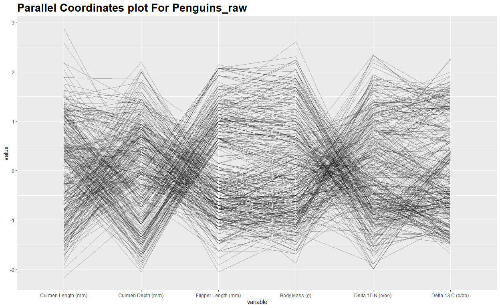
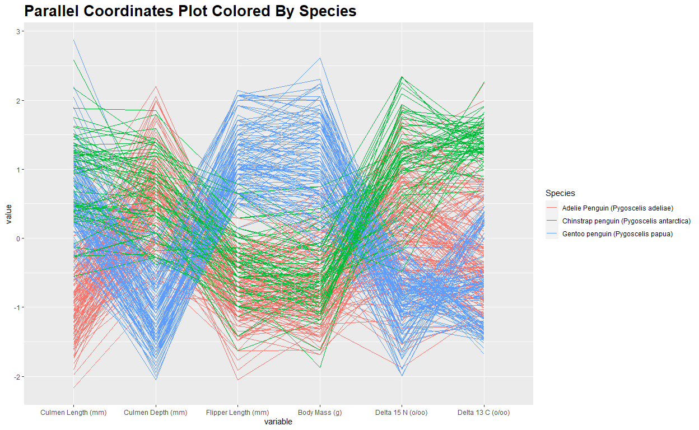
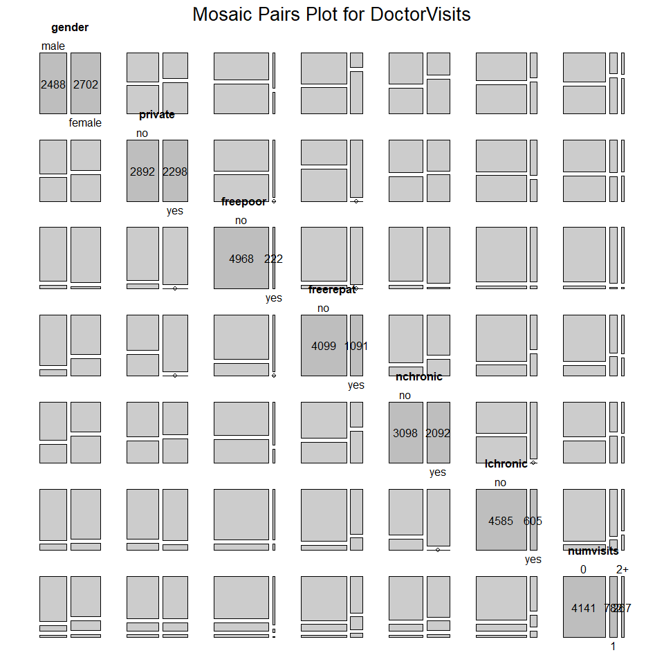
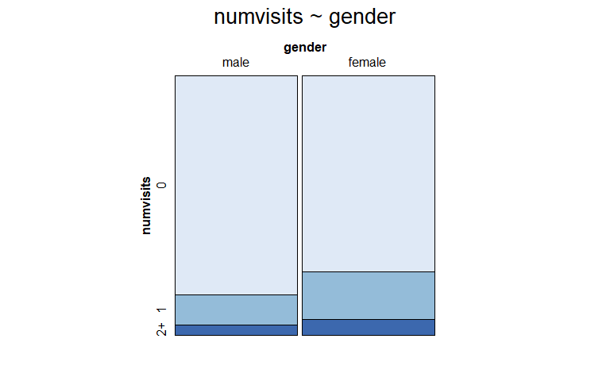
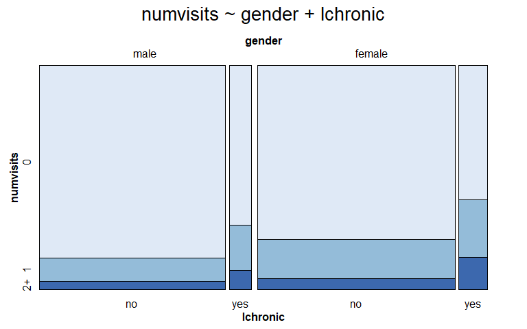
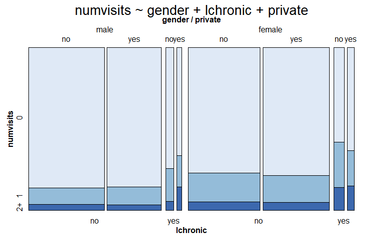
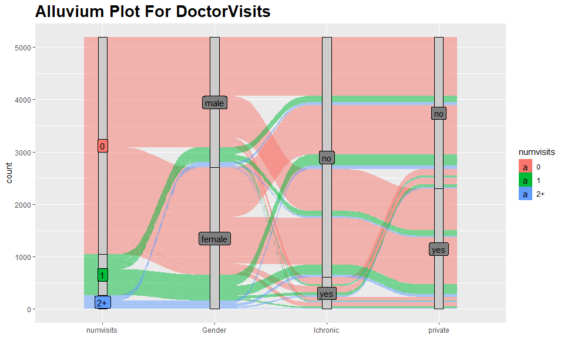
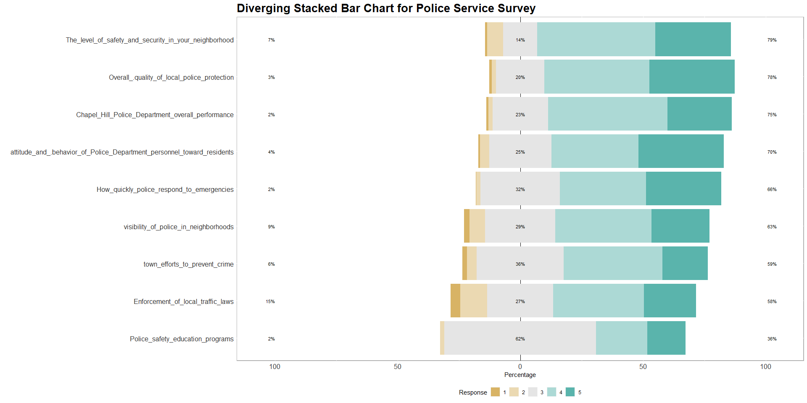

### 1. penguins

We will use the `penguins_raw` dataset from the **palmerpenguins**
package.

a.  Draw a parallel coordinates plot of the numeric columns in the
    dataset using `ggparcoord` from the **GGally** package. Choose
    parameters to help identify trends. What do you observe?

``` r
ggparcoord(dplyr::select_if(penguins_raw, is.numeric), 
           columns=c(2,3,4,5,6,7), 
           alphaLines = 0.3) +
  ggtitle('Parallel Coordinates plot For Penguins_raw') +
  theme(plot.title = element_text(size = 20, face = "bold"))
```

<!-- -->

Answer 1a: There are no direct relationships to be observed, but there
seems to be clusters in the dataset. For instance, from `Culmen Length`
and `Culmen Depth` we can see two separate trends, each of which being a
positive association. Such positive relationship within clusters can be
seen more clearly between `Culmen Length` and `Culmen Depth`. For
`Body Mass` and `Delta 15 N`, it looks like there are negative
correlations within the two clusters, but it needs a more careful
examination. We cannot observe any appearant relationships between
`Flipper Length` and `Body Mass`, or between `Delta 15 N` and
`Delta 13 C`.

b.  Experiment with using color to separate factor levels of the factor
    variables (one at a time, not in the same graph). Include the plot
    which shows the most distinct clusters. Briefly describe how the
    clusters differ from each other. (The factor variable should not be
    included as an axis in the parallel coordinates plot.)

``` r
col_number <- c(10,11,12,13,15,16)
ggparcoord(data=penguins_raw, columns=col_number, 
           groupColumn = 'Species') +
  ggtitle('Parallel Coordinates Plot Colored By Species')+
  theme(plot.title = element_text(size = 20, face = "bold"))
```

<!-- -->

By grouping using the `Species` variable, we see that three different
species of penguins have unique characteristics. Adelie Penguins tend to
have low `Culmen Length`, High `Culmen Depth`, low `Flipper Length`, low
`Body Mass`, high `Delta 15 N` and high `Delta 13 C`. Gentoo penguin,
interestingly, have almost all characteristics in opposite
configuration, and somehow looks symmetric by x-axis. Finally, for
Chinstrap penguins, most of their characteristics lie somewhere between
the former two species. In addition, the correlations between their
characteristics seem not to be as strong as those of the former two
species. By grouping by Species, we can see that there indeed exists
positive or negative relationship between two factors, for example,
there are positive relationship between `Culmen Length` and
`Culmen Deepth` for Adelie and Gentoo penguins, which cannot be easily
concluded in part (a).

### 2. pulitzer

a.  Draw an interactive parallel coordinates plot of the `pulitzer`
    dataset in the **fivethirtyeight** package with brushing using the
    `parcoords()` function in the **parcoords** package.

Interactice Parallel Coordinates Plot for Pulitzer
--------------------------------------------------

``` r
parcoords(data=pulitzer,
          brushMode = "1D-axes", 
          rowname=F, 
          reorderable = T, 
          queue = T)
```

<!--html_preserve-->

b.  Which newspapers appear to be multivariate outliers? Briefly
    describe their unusual patterns.

Wall Street today, Washington Post, New York Times, and Los Angeles
Times appear to be multivariate outliers.

Wall Street today have high Daily Circulation in 2004 and 2013.

Washington Post, New York Times and Los Angeles Times have high values
in Number of Pulitzer Prize winners and finalists from 1990 to 2003,
Number of Pulitzer Prize winners and finalists from 2004 to 2014, and
Number of Pulitzer Prize winners and finalists from 1990 to 2014.

c.  Choose one of the newspapers and research it online to gain a deeper
    understanding of its uniqueness. Provide a brief summary of your
    results. *Cite your sources by linking to the pages where you found
    the information.*

The NYT entered the digital era as early as in 1980s, and started to
work on onsite news since 1996. Also, they make several changes to make
newspaper easier to be distributed. They combined certain sections into
fever categories, and cut the page width from 13.5 inches (34 cm) to a
12 inches (30 cm). Furthermore, they focus on APPs and foreign languages
so that people are gaining attention to NYT in wider areas.

Reference:
<a href="https://en.wikipedia.org/wiki/The_New_York_Times" class="uri">https://en.wikipedia.org/wiki/The_New_York_Times</a>

### 3. doctor visits

For this problem we will use the `DoctorVisits` data set in the **AER**
package. (Note: for this package you need `data("DoctorVisits")` to load
the data.)

a.  We will consider `visits` to be the dependent variable. Create a new
    factor column, `numvisits`, based on `visits`, that contains three
    levels: “0”, “1”, and “2+”. (Tidyverse option:
    `forcats::fct_collapse()`). Why is this a reasonable choice?

``` r
DoctorVisits$visits <- as.factor(DoctorVisits$visits)

DoctorVisits$numvisits <- fct_collapse(DoctorVisits$visits, 
             '0'=c('0'),
             '1'=c('1'),
             '2+'=c('2','3','4','5','6','7','8','9'))

# count instance
DoctorVisits %>% group_by(visits) %>% summarise(count=n())
```

    ## # A tibble: 10 x 2
    ##    visits count
    ##    <fct>  <int>
    ##  1 0       4141
    ##  2 1        782
    ##  3 2        174
    ##  4 3         30
    ##  5 4         24
    ##  6 5          9
    ##  7 6         12
    ##  8 7         12
    ##  9 8          5
    ## 10 9          1

The grouping is reasonable because, if we take a look at the table
above, there are not many data points with high number of visits
(n\>=2). Looking at each group separately is tedious and these groups
cannot really provide insightful information. Grouping these data points
into the same category gives us a decent amount of data points to
perform further investigation.

b.  Draw a mosaic pairs plot of all factor variables in `DoctorVisits`.
    Based on the plot, which variables appear to have a *strong*
    association with `numvisits`? *medium* association? *weak or no*
    association? (Make your judgments relative to the other variables.)

``` r
factor_summary <- DoctorVisits %>% group_by(gender, private, freepoor, freerepat, nchronic, lchronic,numvisits) %>% tally()

pairs(xtabs(n ~ ., factor_summary),
      main = "Mosaic Pairs Plot for DoctorVisits")
```

<!-- -->

`freerepat`, `gender` and `lchornic` appear to have strong
association with numvisit. `freepoor` and `nchornic` appear to have
median association with numvisit. `Private` appear to have no
association with numvisit.

c.  Are p-values from *χ*<sup>2</sup> (chi-squared) tests of each of the
    variables and `numvisits` consistent with your categorization in
    part (b)? Explain briefly.

``` r
# and several more of these 
chisq.test(DoctorVisits$numvisits, DoctorVisits$gender)
```

    ## 
    ##  Pearson's Chi-squared test
    ## 
    ## data:  DoctorVisits$numvisits and DoctorVisits$gender
    ## X-squared = 62.156, df = 2, p-value = 3.184e-14

``` r
chisq.test(DoctorVisits$numvisits, DoctorVisits$private)
```

    ## 
    ##  Pearson's Chi-squared test
    ## 
    ## data:  DoctorVisits$numvisits and DoctorVisits$private
    ## X-squared = 0.17162, df = 2, p-value = 0.9178

``` r
chisq.test(DoctorVisits$numvisits, DoctorVisits$freepoor)
```

    ## 
    ##  Pearson's Chi-squared test
    ## 
    ## data:  DoctorVisits$numvisits and DoctorVisits$freepoor
    ## X-squared = 18.05, df = 2, p-value = 0.0001204

``` r
chisq.test(DoctorVisits$numvisits, DoctorVisits$freerepat)
```

    ## 
    ##  Pearson's Chi-squared test
    ## 
    ## data:  DoctorVisits$numvisits and DoctorVisits$freerepat
    ## X-squared = 111.76, df = 2, p-value < 2.2e-16

``` r
chisq.test(DoctorVisits$numvisits, DoctorVisits$nchronic)
```

    ## 
    ##  Pearson's Chi-squared test
    ## 
    ## data:  DoctorVisits$numvisits and DoctorVisits$nchronic
    ## X-squared = 26.194, df = 2, p-value = 2.052e-06

``` r
chisq.test(DoctorVisits$numvisits, DoctorVisits$lchronic)
```

    ## 
    ##  Pearson's Chi-squared test
    ## 
    ## data:  DoctorVisits$numvisits and DoctorVisits$lchronic
    ## X-squared = 109.26, df = 2, p-value < 2.2e-16

By performing Chi-square test on each pairs of variables, we
see that `gender`, `freerepat`, `nchronic` and `lchronic` have strong
association with `numvisits`, `freepoor` have some association with
numvisits, and we fail to reject the hypothesis that there is no
relationship between `numvisits` and `private`. These tests gave similar
conclusions to our raw prediction in 3(b).

d.  Draw mosaic plots of `gender`, `lchronic`, `private` and `numvisits`
    in stages:

-   `gender` and `numvisits`

-   `gender`, `lchronic` and `numvisits`

-   `gender`, `lchronic`, `private` and `numvisits`

All cuts should be vertical except the last one. The last cut should be
the dependent variable. Use appropriate fill colors. What patterns do
you observe?

``` r
vcd::mosaic(numvisits ~ gender, 
            direction = c("v", "h"),
            highlighting_fill = c("#dfe9f6", "#94bcd9", '#3c68ae'),
            data = DoctorVisits,
            main = 'numvisits ~ gender')
```

<!-- -->

``` r
vcd::mosaic(numvisits ~ gender + lchronic, 
            direction = c("v","v", "h"), 
            highlighting_fill = c("#dfe9f6", "#94bcd9", '#3c68ae'), 
            data = DoctorVisits, 
            main = 'numvisits ~ gender + lchronic')
```

<!-- -->
``` r
vcd::mosaic(numvisits ~ gender + lchronic + private,  
            direction = c("v","v","v", "h"),
            highlighting_fill = c("#dfe9f6", "#94bcd9", '#3c68ae'),
            data = DoctorVisits,
            main = 'numvisits ~ gender + lchronic + private')
```

<!-- -->

The 1st plot tells us that there are slightly more female
than male in the dataset. We can see that `gender` and `numvisits` are
not independent. If you are a female, you are more likely to get higher
number of visits. Looking at the 2nd plot, we can clearly see that only
a small percentage of patients suffered from `lchronic` (which stands
for “a chronic condition limiting activity”). Observe that people suffer
from `lchronic` has been visited more frequently, and this is true for
both male and female group. The 3rd plot is interesting. For both male
and female, for those who suffered from `lchronic`, `private` does not
seem to have an effect on `numvisits`. However, for both male and
female, for those that suffered from `lchronic`, `private` does seem to
influence `numvists`, but in different ways. For male, `numvisists` tend
to increase if `private` is true, but for female, `numvisits` tends to
decrease if `private` is true. Note that such observation is by no means
conclusive, since there are not many data points left after all these
filters.

e.  Use `geom_alluvium()` from the **ggalluvial** package to display the
    same variables as in the last graph of part (d). What new
    information / perspective does the alluvial plot provide, if any?

``` r
visit_summary <- DoctorVisits %>% group_by(gender,, lchronic, private, numvisits) %>% summarise(count=n()) 

ggplot(visit_summary, aes(y=count,
                axis1 = numvisits, axis2 = gender, axis3=lchronic, axis4 = private,
                fill = numvisits), aes.bind=TRUE) +
  geom_alluvium()  +
  geom_stratum(width = 1/12, fill = "grey80") + 
  geom_label(stat = "stratum", aes(label = after_stat(stratum))) + 
  scale_x_discrete(limits = c("numvisits", "Gender", "lchronic",'private')) + 
  ggtitle('Alluvium Plot For DoctorVisits') +
  theme(plot.title = element_text(size = 20, face = "bold"))
```

<!-- -->

Alluvium plot allows us to intuitively capture how many
patients are in each of these combinations.The number of male and female
who received no visits are similar to each other. On the other hand,
female greatly outnumbered male when `numvisits` increases We cannot
absorb this kind of information well in mosaic plots since it is hard to
compare between areas. It is harder to capture information at the
`lchronic` and `private` layer since the flow becomes tiny and thus hard
to compare.

### 4. likert data

a.  Find data online with at least three categorical variables whose
    levels form the same spectrum from one pole to its opposite. A
    common example is likert survey responses with categories such as
    “Strongly agree”, “Agree”, “Neutral”, “Disagree”, “Strongly
    disagree”, but your choice does not need to involve likert data.
    **Provide a link to your data source.**

``` r
# police_service_likert.csv

df <- as.data.frame(read_csv('police_service_likert.csv')) %>% select(2:10)
```

Data Source:

b.  If possible read your data directly from the site. If not (for
    example if it is in pdf form), create a data frame in your code, or
    read it in from a data file that you’ve created. Include the file
    with your submission. Display a table of your data in summarized
    form.

``` r
summarized <- read_csv('police_summary.csv')
summarized
```

    ## # A tibble: 9 x 6
    ##   Questions                                          `1`   `2`   `3`   `4`   `5`
    ##   <chr>                                            <dbl> <dbl> <dbl> <dbl> <dbl>
    ## 1 Overall_.quality_of_local_police_protection          4     7    81   176   143
    ## 2 visibility_of_police_in_neighborhoods                9    26   118   161    97
    ## 3 town_efforts_to_prevent_crime                        8    16   146   165    76
    ## 4 How_quickly_police_respond_to_emergencies            1     7   133   144   126
    ## 5 Enforcement_of_local_traffic_laws                   16    45   111   152    87
    ## 6 Police_safety_education_programs                     0     7   254    86    64
    ## 7 Chapel_Hill_Police_Department_overall_performan~     3     7    93   200   108
    ## 8 attitude_and_.behavior_of_Police_Department_per~     3    15   104   146   143
    ## 9 The_level_of_safety_and_security_in_your_neighb~     3    27    57   198   126

c.  Draw a diverging stacked bar chart of your data, following all best
    practices. You may use any package.

``` r
summary <- likert(df, nlevels=5)

plot(summary, type='bar') + 
  ggtitle('Diverging Stacked Bar Chart for Police Service Survey') +
  theme(plot.title = element_text(size = 20, face = "bold")) + 
  theme(axis.text.x = element_text(color = "grey20", size = 12),
        axis.text.y = element_text(color = "grey20", size = 12))
```

<!-- -->
